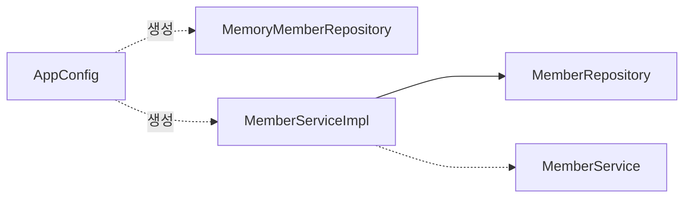

# 관심사의 분리

## 🕴 공연에 비유한 애플리케이션

각 인터페이스 = 배역(배우의 역할)

🤔 로미오 역할을 누가 할지를 배우가 정할까? 

OrderServiceImpl(특정 배우)이 DiscountPolicy(역할)을 FixDiscountPolicy(배우)를 정하는게 맞는가?

관심사를 분리하자

- 배우는 본인의 역할인 배역을 수행하는 것에만 집중한다.
- 역할에 적절한 배우를 지정하는 책임은 **공연 기획자**가 해야 한다

## 🎬 공연 기획자, AppConfig

AppConfig 는 앞서 비유한 공연 기획자와 같다.

```jsx
public class AppConfig {
  public MemberService memberService() {
    return new MemberServiceImpl(new MemoryMemberRepository());
  }

  public OrderSerivce orderService() {
	  return new OrderServiceImpl(
		  new MemoryMemberRepository(), 
		  new FixDiscountPolicy());
  }
}
```

😎 MemberSerivceImpl은 이제 구현 클래스를 모른다!

AppConfig가 하는 역할은?

- 애플리케이션 실제 동작에 필요한 “구현 객체를 생성”함
- 생성한 객체 인스턴스의 참조를 “생성자를 통해서 주입” 해줌

MemberServiceImpl은 어떻게 바뀌었나?

- 의존관계에 대한 고민은 외부에 맡기고 “동작에만 집중” 한다.



## 애플리케이션을 실행해보자

```java
public class MemberApp {
	public static void main(String[] args) {
		AppConfig appConfig = new AppConfig();

		MemberService memberService = appConfig.memberService(); 

		memberService.join(new Member(..));
		...
	}
}
```

테스트 코드에서는 어떻게 설정할까?

```java
class MemberServiceTest [
  MemberService memberService();
	
	@BeforeEach
	void beforeEach() {
		AppConfig appConfig = new AppConfig();
		memberService = appConfig.memberService();
	}
}
```

🤔 위 코드의 문제점은 무엇일까? 
- 테스트 코드에서 구현 클래스를 정하지 못한다.
- 구성(Configuration) 코드가 테스트 코드에 영향을 미친다.
